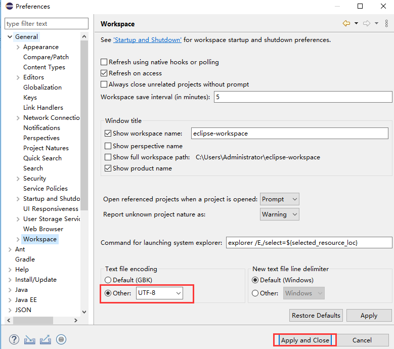
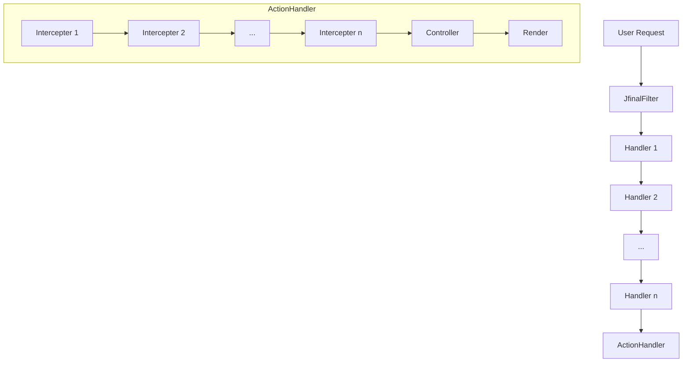
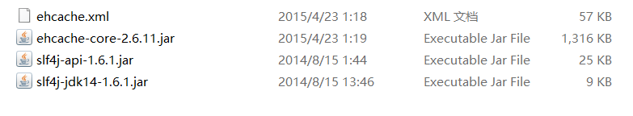
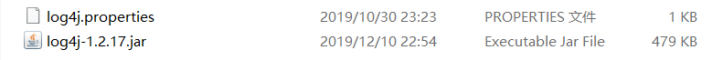
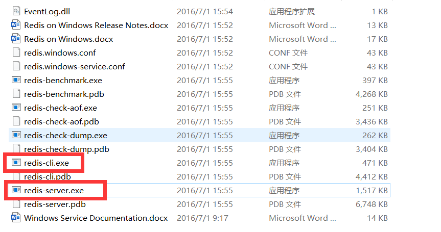
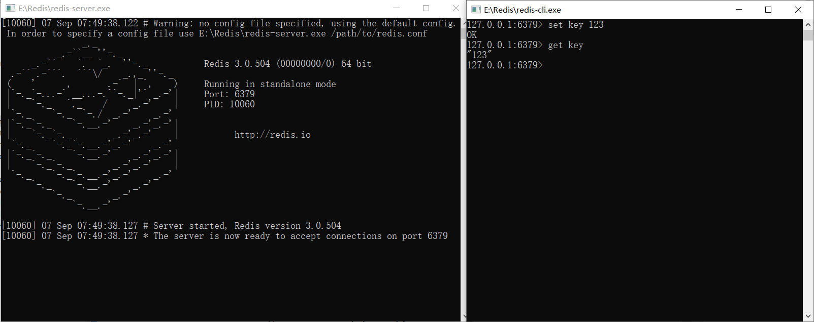
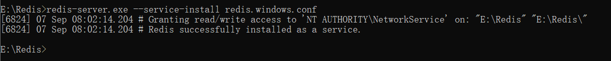
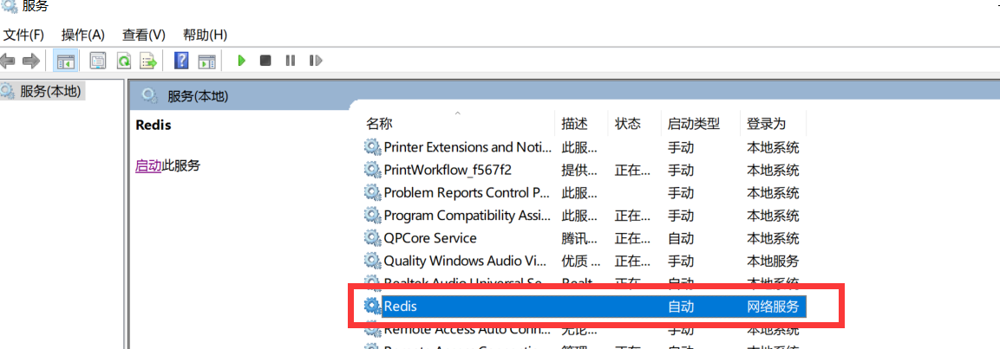
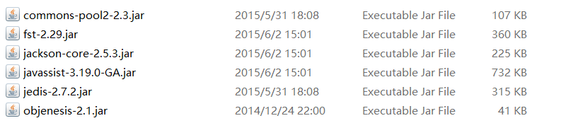

# JFinal学习笔记

## 1. 准备工作

### 1.1 Eclipse下载与安装

* 推荐下载[Eclipse IDE for Java Developers](https://www.eclipse.org/downloads/packages/release/2020-06/r/eclipse-ide-java-developers)

  新建项目时没有“Dynamic Web Project”

  点击“Help” -> 再点击“Install New Software”->“Work with”中输入对应地址->展开Web, XML, Java EE and OSGi Enterprise Development”这个选项->选中下图四个下载->等待下载...->重启Eclipse

  
  
* 设置编码格式

  Window->Preferences->General->Workspace

  

* 调整字体大小

  Window->Preferences->General->Appearance->Colors and Fonts->Basic->Text Font

  

### 1.2 非Maven形式下开发

* 创建Dynamic Web Project

  1. File->New->Project

     

     

     

  2. 修改Default output folder，推荐输入WebRoot\WEB-INF\classes

     ​	

     ​	此处Default output folder必须要与WebRoot\WEB-INF\classes目录完全一致才可以使用JFinal集成的Jetty来启动项目

  3. Content directory输入WebRoot，勾选创建web.xml

     

     4. 放入JFinal库文件

        [下载JFinal 4.9.01 all](https://jfinal.com/download/now?file=jfinal-4.9.01-all.zip)

        将jetty-server-2019.3.jar和jfinal-4.9.01-bin-with-src.jar拷贝至项目WEB-INF\lib下即可。

     5. 修改web.xml

        文件在项目的WEB-INF目录下

        ~~~xml
        <filter>
            <filter-name>jfinal</filter-name>
            <filter-class>com.jfinal.core.JFinalFilter</filter-class>
            <init-param>
               <param-name>configClass</param-name>
               <param-value>demo.DemoConfig</param-value>
            </init-param>
        </filter>
        <filter-mapping>
            <filter-name>jfinal</filter-name>
            <url-pattern>/*</url-pattern>
        </filter-mapping>
        ~~~

     6. 添加Java文件

         在项目src目录下创建demo包，并在demo包下创建HelloController文件， 内容如下：

        ~~~java
        package demo;
        import com.jfinal.core.Controller;
        public class HelloController extends Controller {
            public void index() {
               render	Text("Hello JFinal World.");
            }
        }
        ~~~

         在项目src目录下创建demo包，并在demo包下创建DemoConfig文件， 内容如下：

        ~~~java
        package demo;
        import com.jfinal.config.*;
        public class DemoConfig extends JFinalConfig {
            public void configConstant(Constants me) {
               me.setDevMode(true);
            }
            public void configRoute(Routes me) {
               me.add("/hello", HelloController.class);
               me.add("/", HelloController.class);//添加路由
            }
            public void configEngine(Engine me) {}
            public void configPlugin(Plugins me) {}
            public void configInterceptor(Interceptors me) {}
            public void configHandler(Handlers me) {}
        }
        ~~~

     7. 启动项目

        Run Configurations

        Main class输入框中填入: com.jfinal.core.JFinal，然后启动

        

        调整端口

        

        上面的启动配置也可以使用一个任意的main方法代替。在任意一个类文件中添加一个main启动集成的jetty如下图所示：

        ~~~java
        public static void main(String[] args) {
        	JFinal.start("WebRoot", 8000, "/", 5);
        }
        ~~~

        上面代码的第一个参数 DemoConfig 是继承自 JFinalConfig 的配置入口类，第二个参数是端口号，第三个参数是 devMode。

     8. 开启浏览器查看效果

        打开浏览器在地址栏中输入: http://localhost:8000/hello，输出内容为Hello JFinal World证明项目框架搭建完成。
        
        查看端口是否被占用(dos命令netstat -ano|findstr "端口号")

### 1.3 Maven下载与安装以及配置eclipse 指向 maven

1. 下载[apache-maven-3.6.3-bin.zip](https://mirrors.bfsu.edu.cn/apache/maven/maven-3/3.6.3/binaries/apache-maven-3.6.3-bin.zip)

2. 将 maven 解压到某个目录中，配置环境变量

   

   

   

3. 配置eclipse 指向 maven

   1. 不使用Eclipse嵌入的maven，因为不可靠也不方便，例如在控制台无法使用 maven 的命令行进行操作

      Window->Preference->Maven->Installatioins

      

      Window->Preference->Maven->User Settings

      为其配置好两个settings.xml文件即可，这两个文件在maven安装目录的conf子目录之下

      
   

## 2. Controller

### 2.1 JFinal访问流程图

### 2.2 Action

#### 2.2.1 Action定义

​	在 Controller 之中定义的 public 方法称为Action。Action 是请求的最小单位。Action 方法必须在 Controller 中定义，且必须是 public 可见性。

~~~java
public class HelloController extends Controller {
    public void index() {
       renderText("此方法是一个action");
    }
    public String test() {
       return "index.html";
    }
}
~~~

 	Action可以有返回值，返回值可在拦截器中通过invocation.getReturnValue() 获取到，以便进行render控制。

#### 2.2.2 @NotAtion注解

​	如果希望 controller 中的 public 方法不成为一个 action，可以使用 @NotAction 注解。@NotAction 注解通常用于引入了 BaseController 的中间 Controller，例如：

~~~java
public class BaseController extends Controller {
   // 不希望成为 action，仅供子类调用，或拦截器中调用
   @NotAction
   public void getLoginUser() {
   }
}
~~~

#### 2.2.3 控制器超类的路由映射

​	自 jfinal 3.6 开始，控制器超类中的所有方法**默认不会**被映射为 action。

​	如果希望超类中的方法也被映射为 action 只需添加一行配置：

~~~java
public void configRoute(Routes me) {
    me.setMappingSuperClass(true);
}
~~~

### 2.3 数据接收

#### 2.3.1 get/getPara方法

getPara提供两种类型

* 形参为String类型，获取表单或者url问号后的域值
* 形参为int类型或无形参，获取urlPara中的值

~~~java
String title = get("title");//替代getPara
Integer age = getInt("age");//替代getParaToInt
~~~

#### 2.3.2 getBean/getModel

getModel 接收表单域传递的 model 对象，表单域名称以 “modelName.attrName” 取名，getModel 使用的 attrName 必须与数据表字段名完全一样。

getBean 用于支持传统 Java Bean ，包括支持使用 jfinal 生成器生成了 getter 、 setter 方法的 Model ，传参的 attrName 与 setter 方法相一致的attrName。

~~~java
public class Article {
	private String title;
	private String content;
	public String getTitle() {return title;}
	public void setTitle(String title) {this.title = title;}
	public String getContent() {return content;}
	public void setContent(String content) {this.content = content;}
	@Override
	public String toString() {
		return "Article [title=" + title + ", subtitle=" + subtitle + ", content=" + content + "]";
	}
}
// 在页面表单中采用modelName.attrName形式为作为表单域的name
<form action="/" method="post">
  <input name="article.title" type="text">
  <input name="arti.content" type="text">
  <input value="提交" type="submit">
</form>
public class IndexController extends Controller {
	public void index() {
        // 页面的modelName正好是Article类名的首字母小写或指定任意名
        Article article1 = getBean(Article.class);
		Article article2 = getBean(Article.class, "arti");
		System.out.println(article1.toString());
        System.out.println(article2.toString());
		render("index.html");
	}
}
~~~

#### 2.3.3 set/setAttr

​	将数据传递给 view 并在 view 中显示出来

~~~java
set("article", article);//替代setAttr
// 链式用法
set("project", project).set("replyList", replyList).render("index.html");
~~~

#### 2.3.4 render方法

​	render(String view) 方法将对 view 所指向的模板进行渲染，view 参数最终指向的模板文件规则如下：

~~~java
String template = baseViewPath + viewPath + view;
~~~

​	其中 view 即为 render(String view) 方法所携带的参数值，而 baseViewPath、viewPath 则是在路由配置时指定的两个值，例如：

~~~java
public void configRoute(Routes me) {
    // baseViewPath 为 "/view"，该 Routes 对象之下映射的所有 Controller 都将取这个值
	me.setBaseViewPath("/view");
    // viewPath 为第三个参数 "/a"
	me.add("/aa", IndexController.class, "a");
    // 第三个参数省略时， viewPath 取第一个参数的值 : "/b"
    me.add("/b", IndexController.class);
}
public class IndexController extends Controller {
	public void index() {
        //指向 WebRoot 目录下面的 "/view/a/index.html" 。
		render("index.html");
	}
}
~~~

​	在一个action中多次调用render方法后面的render会覆盖前面的，但renderError会直接抛出异常。

#### 2.3.5 getFile方法

~~~java
public void configConstant(Constants me) {
	me.setMaxPostSize(1024 * 1024 * 100);//设置文件可接受最大大小
	me.setBaseUploadPath("upload/a");//设置文件上传路径
}
//表单中enctype="multipart/form-data"
<form action="/upload" method="post" enctype="multipart/form-data">
  <input name="article.title" type="text">
  <input name="arti.content" type="text">
  <input type="file" id="exampleInputFile" name="touxiang">
  <input type="file" id="exampleInputFile" name="wenjian">
  <input value="提交" type="submit">
</form>
public class IndexController extends Controller {
	public void index() {
		render("index.html");
	}
	public void upload() {
		getFile();
        get("arti.content");
        getFile("touxiang");
        getFile("wenjian", "路径");
		renderText("upload...");
	}
}
~~~

​	**特别注意**：如果客户端请求为multipart request（form表单使用了enctype="multipart/form-data"），那么必须先调用getFile系列方法才能使getPara系列方法正常工作，因为multipart request需要通过getFile系列方法解析请求体中的数据，包括参数。**同样的道理在Interceptor、Validator中也需要先调用getFile。**

​	me.setBaseUploadPath("路径")，该路径参数接受以”/”打头或者以windows磁盘盘符打头的绝对路径，即可将基础路径指向项目根径之外，方便单机多实例部署。当该路径参数设置为相对路径时，则是以项目根为基础的相对路径。

#### 2.3.6 keep系列

keepPara()

~~~java
// 保持住所有表单域
keepPara()
 
//指定保持住的表单域，如： nickName、email 等等
keepPara("nickName", "email", ...);

// 指定 keep 后的类型为 Date
keepPara(Date.class, "createAt");
 
// 指定 keep 后的类型为 Integer
keepPara(Integer.class, "age");
~~~

keepModel 与 keepBean

keepModel 与 keepBean 都可以 keep 住表单域原有的类型，无需指定类型

~~~java
<input name="blog.title"   value="#{blog.title}"/>
<input name="blog.content" value="#{blog.content}" />
~~~

### 2.4 Http协议

#### 2.4.1 状态码

|       状态码、状态        |                             解释                             |
| :-----------------------: | :----------------------------------------------------------: |
|          200 OK           |                       请求被成功地完成                       |
|         301 Found         |                重定向，但表示旧URL永久地移除                 |
|         302 Found         | 重定向，新的URL会在response中的Location中返回，浏览器会将会自动使用新的URL发出新的Request |
|     304 Not Modified      |      上次的请求数据，在浏览器中已经被缓存了，可继续使用      |
|      400 Bad Request      |            客户端请求与语法错误，不能被服务器理解            |
|       403 Forbidden       |               服务端收到请求，但是拒绝提供服务               |
|       404 Not Found       |                     浏览器找不到请求地址                     |
| 500 Internal Server Error |                  服务器发生了不可预期的错误                  |

#### 2.4.2 Cookie

* 使用Cookie实现登录功能
* 防止Cookie三方插件修改，安全策略

~~~java
public void configRoute(Routes me) {
	me.add("/user", IndexController.class);	
}

public class IndexController extends Controller {
	public void index() {
		render("index.html");
	}
	public void login() {
		String name = get("name");
		String pwd = get("pwd");
		if(users.containsKey(name) && users.get(name).equals(pwd)) {
			String saveTime = System.currentTimeMillis() + "";
			String userCookie = name + COOKIE_SEPARATOR + HashKit.md5(name + mm + saveTime + "10") + COOKIE_SEPARATOR + saveTime + COOKIE_SEPARATOR + "10";
			setCookie("user", userCookie, 10);
			redirect("/user/center");
			return ;
		}else {
			redirect("/user");
			return ;
		}
	}
	public void center() {
		String userCookie = getCookie("user");
		if(userCookie == null) {
			redirect("/user");
			return ;
		}
		String[] userInfo = userCookie.split(COOKIE_SEPARATOR);
		if(!HashKit.md5(userInfo[0] + mm + userInfo[2] + userInfo[3]).equals(userInfo[1])) {
			redirect("/user");
			return ;
		}
		renderText("欢迎" + userInfo[0] + "的主页面...");
	}
	static Map<String, String> users = new HashMap<>();
	static String mm = UUID.randomUUID().toString();
	final static String COOKIE_SEPARATOR = "#xw#";
	static {
		users.put("zs", "123");
	}
}
~~~

#### 2.4.3 Session

​	通过 setSessionAttr(key, value) 可以向 session 中存放数据，getSessionAttr(key) 可以从 session 中读取数据。还可以通过 getSession()得到 session 对象从而使用全面的session API。

~~~java
public void login() {
   User user = loginService.login(...);
   if (user != null) {
      setSessionAttr("loginUser", user);
   }
}
~~~

对于分布式和集群注意：

* 使用Cookie代替，不使用Session
* 将session存储到专门的容器插件中，如：redis、ehcache等

#### 2.4.4 Cookie与Session区别

* Cookie存放在浏览器中，不安全；Session存放在服务器中，安全。
* 但当访问增多时，会比较占用你服务器的性能，考虑到减轻服务器性能方面，应当使用cookie。
* 单个cookie保存的数据不能超过4K，很多浏览器都限制一个站点最多保存20个cookie，而session则存储于服务端，浏览器对其没有限制。

#### 2.4.5 重定向与转发

redirect(String url)

* 客户端发起 http 请求
* 服务器接收请求并发送302状态码以及 Location （新的URL）给客户端
* 客户端接收302响应，并根据 Location 中的 URL 再次发送新的 http 请求

forwardAction(String url)或直接调用方法

* 客户端发起 http 请求

* 服务器接收请求并把 request/response 处理权交给内部的另一个地址（方法），再响应

* 客户端接收响应

  直接调用方法不会经过拦截器

防止重复提交

* 使用token

  ~~~java
  createToken();
  createToken(tokenName, secondsOfTimeOut);
  validateToken()	//验证
  ~~~

* 使用TokenCache

## 3. Handler

### 3.1 执行流程

1. 执行Handler链，最终到ActionHandler
2. ActionHandler执行流程
   * 判断是否是Action请求，否就结束
   * 创建Controller
   * 创建拦截器链
   * 执行拦截器
   * 获得Render，执行渲染

​	JFinalFilter（init方法）<--JFinal（init方法<--initHandler方法）<--HandlerFactory（getHandler方法返回Handler链的头handler）

**HandlerFactory（形成Handler链）：**

~~~java
public static Handler getHandler(List<Handler> handlerList, Handler actionHandler) {
    Handler result = actionHandler;
    for (int i=handlerList.size()-1; i>=0; i--) {
        Handler temp = handlerList.get(i);
        temp.next = result;
        temp.nextHandler = result;
        result = temp;
    }
    return result;
}
~~~

**JFinal（得到Handler链的链首）：**

~~~java
private void initHandler() {
    ActionHandler actionHandler = Config.getHandlers().getActionHandler();
    if (actionHandler == null) {
        actionHandler = new ActionHandler();
    }
    actionHandler.init(actionMapping, constants);
    handler = HandlerFactory.getHandler(Config.getHandlers().getHandlerList(), actionHandler);
}
~~~

### 3.2 自定义Handler的使用

~~~java
@Override
public void configHandler(Handlers me) {
    //配置，添加Handler
    me.add(new Handler1());
    me.add(new Handler2());
}

//继承Handler
public class Handler1 extends Handler {
	@Override
	public void handle(String target, HttpServletRequest request, HttpServletResponse response, boolean[] isHandled) {
		//执行下一个Handler的handle操作
		next.handle(target, request, response, isHandled);
	}
}
~~~

### 3.3 项目中Handler的应用

## 4. AOP

Aspect Oriented Programming面向切面编程

​	通过预编译方式和运行期动态代理实现程序功能的统一维护的一种技术。使得业务逻辑各部分之间的耦合度降低，提高程序的可重用性，同时提高了开发的效率。

### 4.1 Interceptor、Before、Cear

#### 4.1.1 Interceptor执行流程

1. ActionHandler中执行Invocation对象中invoke方法，开始执行拦截器（即intercept方法）

2. 拦截器每次结束后再次调用Invocation对象中invoke方法，以执行下一拦截器，若没有拦截器执行那通过反射执行对应 action 方法

ActionHandler（handle方法）<--Invocation（invoke方法）

**ActionHandler（实例化 Invocation 并执行 invoke 方法）**

~~~java
public void handle(String target, HttpServletRequest request, HttpServletResponse response, boolean[] isHandled) {
    //只截取部分
    new Invocation(action, controller).invoke();
}
~~~

**Invocation（执行对应拦截器的 intercept 方法，再通过反射执行 action 方法）**

~~~java
public void invoke() {
    if (index < inters.length) {
        //执行拦截器
        inters[index++].intercept(this);
    }
    else if (index++ == inters.length) {	// index++ ensure invoke action only one time
        try {
            // Invoke the action
            if (action != null) {
                returnValue = action.getMethod().invoke(target, args);
            }
            // Invoke the callback
            else {
                returnValue = callback.call(args);
            }
        }
        catch (InvocationTargetException e) {
            Throwable t = e.getTargetException();
            if (t == null) {t = e;}
            throw t instanceof RuntimeException ? (RuntimeException)t : new RuntimeException(t);
        }
        catch (RuntimeException e) {
            throw e;
        }
        catch (Throwable t) {
            throw new RuntimeException(t);
        }
    }
}
~~~

**拦截器执行顺序：**拦截器各级别执行的次序依次为：Global、Routes、Class、Method，如果同级中有多个拦截器，那么同级中的执行次序是：配置在前面的先执行。

**Clear：**用于清除**自身所处层次以上层**的拦截器。

#### 4.1.2 自定义Interceptor、Before以及Clear的使用

~~~java
@Override
public void configInterceptor(Interceptors me) {
    //配置，添加全局Interceptor
    me.add(new Interceptor1());
}
//添加控制器
@Before(Interceptor2.class)
public class InterceptorController extends Controller {
	@Before(Interceptor3.class)
	public void index() {
		render("/simple.html");
	}
    //清除所有控制器
	@Clear
	public void action1() {
		renderText("action1...");
	}
	@Clear(Interceptor1.class)
	public void action2() {
		renderText("action2...");
	}
    //清除多个控制器
	@Clear({Interceptor1.class,Interceptor2.class})
	public void action3() {
		renderText("action3...");
	}
}
//实现Interceptor
//invoke()前后插入切面代码可以很方便地实现AOP
public class Interceptor2 implements Interceptor {
	@Override
	public void intercept(Invocation inv) {
        System.out.println("Before method invoking");
		//执行下一个Interceptor
		inv.invoke();
        System.out.println("After method invoking");
	}
}
~~~

**注意**：如果是刻意不去调用剩下的拦截器与 action，需要使用 inv.getController().render()/renderJson() 调用一下相关的 render() 方法为客户端响应数据。

 更正一下上面截图中倒数第三行的一处手误：setArg(int) 应该改为 setArg(int, Object)

#### 4.1.3 常用自带Interceptor的使用

##### 4.1.3.1 CacheInterceptor和EvictInterceptor

​	CacheInterceptor可以将action所需数据全部缓存起来，下次请求到来时如果cache存在则直接使用数据并render，而不会去调用action。

导入ehcache相关jar包以及配置xml

~~~xml
<!-- 在ecache.xml中配置自定义cache -->
<cache name="action"
       maxEntriesLocalHeap="10000"
       maxEntriesLocalDisk="1000"
       eternal="false"
       diskSpoolBufferSizeMB="20"
       timeToIdleSeconds="300"
       timeToLiveSeconds="600"
       memoryStoreEvictionPolicy="LFU"
       transactionalMode="off">
    <persistence strategy="localTempSwap"/>
</cache>
~~~

导入log4j相关jar包以及properties

​	将xml和properties添加到src目录下

~~~java
@Override
public void configPlugin(Plugins me) {
    me.add(new EhCachePlugin());
}
public class InterceptorController extends Controller {
    //添加cache
    @Before(CacheInterceptor.class)
    @CacheName("action")
    public void index() {
        System.out.println("这里是index。。。");
        renderJson("index");
    }
    //清除cache
    @Before(EvictInterceptor.class)
	@CacheName("action")
	public void action1() {
		renderText("action1...");
	}
}
~~~

##### 4.1.3.2 SessionInViewInterceptor

添加session到页面之后，页面进行取值渲染

action2.html

~~~html
<!DOCTYPE html>
<html>
<head>
<meta charset="UTF-8">
<title>Insert title here</title>
</head>
<body>
${(session.username)!'没有username'}
</body>
</html>
~~~

~~~java
public class InterceptorController extends Controller {
	@Before(SessionInViewInterceptor.class)
    public void action2() {
        setSessionAttr("username", "张三");
        render("/action2.html");
    }
}
~~~

##### 4.1.3.3 Get和Post

只允许get或post请求

~~~java
public class InterceptorController extends Controller {
	@Before(GET.class)
	public void action3() {
		renderText("action3...");
	}
}
~~~

##### 4.1.3.4 NotAction

让Action变成普通方法

~~~java
//自 jfinal 3.5 开始，不建议使用 NotAction 拦截器，而是使用 com.jfinal.core 包下面的 @NotAction 注解来取代
//用法：@Before(NotAction.class) 改成 @NotAction
@NotAction
public void action4() {
    renderText("action4...");
}
~~~

#### 4.1. 4项目中Interceptor的应用

### 4.2 Aop工具

#### 4.2.1 Inject

**config**

~~~java
public void configConstant(Constants me) {
    // 开启对 jfinal web 项目组件 Controller、Interceptor、Validator 的注入
    me.setInjectDependency(true);
    // 开启对超类的注入。不开启时可以在超类中通过 Aop.get(...) 进行注入
    me.setInjectSuperClass(true);
}
~~~

**Controller**

~~~java
public class AccountController {
   @Inject
   AccountService service;    // 此处会注入依赖对象
   public void index() {
       service.justDoIt();    // 调用被注入对象的方法
   }
}
~~~

#### 4.2.2 Aop

~~~java
//通过Aop.get(...)创建对象并且对其进行依赖注入
//如果 Service 中使用了 @Before 配置过拦截器，那么会生效，如果 Service 中的属性使用了 @Inject，则会被注入依赖对象
Service service = Aop.get(Service.class);
//通过Aop.inject(...)对目标对象进行注入
//会对 Service 类中使用 @Inject 注解过的属性进行依赖注入。
Service service = new Service(...);
Aop.inject(service);
~~~

## 5. 数据库操作

### 5.1 使用JFinal Model对数据库的增删改查操作

**数据库**

~~~sql
create table tb_user(
    id int primary key AUTO_INCREMENT,
    name varchar(100),
    password varchar(100)
);
insert into tb_user values("zhanngshan", "123");
~~~

**UserModel**

~~~java
public class UserModel extends Model<UserModel> {
	private static final long serialVersionUID = 1L;
	public static UserModel Dao = new UserModel();
}
~~~

**Config**

~~~java
@Override
public void configPlugin(Plugins me) {
    me.add(new EhCachePlugin());
    DruidPlugin druidPlugin = new DruidPlugin("jdbc:mysql://localhost:3306/jfinal?characterEncoding=utf8", "root", "root");
    //DruidPlugin druidPlugin = new DruidPlugin("jdbc:oracle:thin:@localhost:1521:ORCL", "XW", "Zz123456");
    me.add(druidPlugin);

    ActiveRecordPlugin activeRecordPlugin = new ActiveRecordPlugin(druidPlugin);
    //activeRecordPlugin.setContainerFactory(new CaseInsensitiveContainerFactory());
    activeRecordPlugin.addMapping("tb_user", UserModel.class);
    activeRecordPlugin.setShowSql(true);
    //activeRecordPlugin.setDialect(new OracleDialect());//设置识别数据源方言
    me.add(activeRecordPlugin);
}
~~~

**Action**

~~~java
//add
UserModel addUser = new UserModel();
addUser.set("name", "李四");
addUser.set("password", "123");
addUser.save();

//deleteById
UserModel.Dao.deleteById(addUser.getStr("id"));

//update
UserModel updateUser = UserModel.Dao.findById(1);
updateUser.set("name", "王五");//password不变
updateUser.update();

//findBySQL
UserModel findBySQLUser = new UserModel();
findBySQLUser.findFirst("select * from tb_user where id = 1");
~~~

### 5.2 使用JFinal Model对数据库的高级查询操作

#### 5.2.1 拼接SQL并进行查询

**数据库**

~~~sql
alter table tb_user add column mobile varchar(32);
alter table tb_user add column sex int;
~~~

**UserService**

~~~java
private static UserModel Dao = new UserModel();
// 根据id获取用户
public static UserModel findById(Object id) {
    return Dao.findById(id);
}
// 根据mobile获取用户列表
public static List<UserModel> findByMobile(Object Mobile) {
    String sql = "select * from tb_user where mobile = ?";
    return Dao.find(sql, Mobile);
}
// 根据多个参数获取用户列表
public static List<UserModel> findByPara(Object name, Object mobile, Integer sex) {
    String sql = "select * from tb_user where 1=1";
    if (name != null)
        sql += (" and name like %" + name.toString() + "%");
    if (mobile != null)
        sql += (" and mobile=" + mobile.toString());
    if (sex != null)
        sql += (" and sex=" + sex);
    return Dao.find(sql);
    //面对以往sql中where 1=1影响性能采取方案
    //StringBuffer sb_sql = new StringBuffer("select * from tb_user");
    //boolean flag = true;
    //List<Object> params = new ArrayList<>();
    //AppendParaLike(name, "name", params, sb_sql, flag);
    //AppendPara(mobile, "mobile", params, sb_sql, flag);
    //AppendPara(sex, "sex", params, sb_sql, flag);
    //return Dao.find(sb_sql.toString(), params.toArray());
}
//抽出的工具方法
private static void AppendParaLike(Object field, String para, List<Object> params, StringBuffer sb_sql, boolean flag) {
    if(field != null) {
        if(flag) {
            sb_sql.append(" where");
            flag=false;
        }else {
            sb_sql.append("and");
        }
        sb_sql.append(" "+ para +" like %?%");
        params.add(field);
    }
}
private static void AppendPara(Object field, String para, List<Object> params,StringBuffer sb_sql, boolean flag) {
    if(field != null) {
        if(flag) {
            sb_sql.append(" where");
            flag=false;
        }else {
            sb_sql.append("and");
        }
        sb_sql.append(" "+ para +"=?");
        params.add(field);
    }
}
~~~

**Action**

~~~java
public void index() {
    //根据id获取user
    UserModel user1 = UserService.findById("1");
    System.out.println(user1.getStr("name") + "-" + user1.getStr("password") + "-" + user1.getStr("mobile") + "-" + user1.getInt("sex"));

    //根据id获取users
    List<UserModel> users2 = UserService.findByMobile("15755447788");
    for(UserModel user:users2) {
        System.out.println(user.getStr("name") + "-" + user.getStr("password") + "-" + user.getStr("mobile") + "-" + user.getInt("sex"));
    }

    //根据多个参数获取users
    List<UserModel> users3 = UserService.findByPara(null, null, 1);
    for(UserModel user:users3) {
        System.out.println(user.getStr("name") + "-" + user.getStr("password") + "-" + user.getStr("mobile") + "-" + user.getInt("sex"));
    }	
    renderText("ok");
}
~~~

#### 5.2.2 批量查询

~~~java
public void index() {
    //通过sql查询记录数
    String sql = "select count(*) from tb_user";
    long count = Db.queryLong(sql);
    System.out.println(count);
	//通过sql批量添加user
    List<UserModel> list = new ArrayList<>();
    UserModel user;
    for (int i = 0; i < 10; i++) {
        user = new UserModel();
        user.set("name", "李四"+i);
        user.set("password", "123");
        user.set("mobile", "1575904778"+i);
        user.set("sex", 2);
        list.add(user);
    }
    Db.batchSave(list, list.size());
	//通过sql批量查询，返回全部记录
    List<Record> records = Db.find("select * from tb_user");
    for (Record record : records) {
        System.out.println(record.getStr("name") + "-" + record.getStr("password") + "-" + record.getStr("mobile") + "-" + record.getInt("sex"));
    }
    renderText("ok");
}
~~~

### 5.3 分页

* 使用Enjoy引擎渲染页面
* 使用ehcache缓存（提高性能，减少数据库反复提交事务）

**ehcache.xml**

~~~xml
<cache name="pagecache"
       maxEntriesLocalHeap="10000"
       maxEntriesLocalDisk="1000"
       eternal="false"
       diskSpoolBufferSizeMB="20"
       timeToIdleSeconds="300"
       timeToLiveSeconds="600"
       memoryStoreEvictionPolicy="LFU"
       transactionalMode="off">
    <persistence strategy="localTempSwap"/>
</cache>
~~~

**pageFile.html**

~~~html
<!DOCTYPE html>
<html>
<head>
<meta charset="UTF-8">
<title>Insert title here</title>
</head>
<body>
#for(user : pageUser.getList())
	#(user.name)---#(user.password)---#(user.mobile)---#(user.sex) 
#end
#@paginate(pageUser.pageNumber, pageUser.totalPage, "/")
</body>
</html>
~~~

**_paginate.html**

~~~html
#define paginate(currentPage, totalPage, link)
	#if(totalPage <= 0 || currentPage > totalPage) #return #end
	#setLocal(startPage = currentPage - 4)
	#if (startPage < 1) #setLocal(startPage = 1) #end
	
	#setLocal(endPage = currentPage + 4)
	#if (endPage > totalPage) #setLocal(endPage = totalPage) #end
	
	

			#if (currentPage <= 8)
				#setLocal(startPage = 1)
			#end
			#if ((totalPage - currentPage) < 8)
				#setLocal(endPage = totalPage)
			#end
			
			#if (currentPage == 1)
				上页
			#else
				<a href="#(link)#(currentPage - 1)#(append)" class="prev_page">上页</a>
			#end
			
			#if (currentPage > 8)
				<a href="#(link)#(1)#(append)">#(1)</a>
				<a href="#(link)#(2)#(append)">#(2)</a>
				…
			#end
			
			#for(i : [startPage..endPage])
				#if (currentPage == i)
					#(i)
				#else
					<a href="#(link)#(i)#(append)">#(i)</a>
				#end
			#end
			
			#if ((totalPage - currentPage) >= 8)
				…
				<a href="#(link)#(totalPage - 1)#(append)">#(totalPage - 1)</a>
				<a href="#(link)#(totalPage)#(append)">#(totalPage)</a>
			#end
			
			#if (currentPage == totalPage)
				下页
			#else
				<a href="#(link)#(currentPage + 1)#(append)" class="next_page" rel="next">下页</a>
			#end
	

#end
~~~

**Config**

~~~java
@Override
public void configEngine(Engine me) {
    me.addSharedFunction("_paginate.html");
}
@Override
public void configPlugin(Plugins me) {
    me.add(new EhCachePlugin());
    DruidPlugin druidPlugin = new DruidPlugin("jdbc:mysql://localhost:3306/jfinal?characterEncoding=utf8", "root", "root");
    me.add(druidPlugin);

    ActiveRecordPlugin activeRecordPlugin = new ActiveRecordPlugin(druidPlugin);
    activeRecordPlugin.addMapping("tb_user", UserModel.class);
    activeRecordPlugin.setShowSql(true);
    me.add(activeRecordPlugin);
}
~~~

**UserService**

~~~java
// 换页
public static Page<UserModel> paginate(int pageNumber, int pageSize, Object name, Object mobile, Integer sex) {
    String sql_select = "select *";
    StringBuffer sql_sqlExceptSelect = new StringBuffer("from tb_user");
    boolean flag = true;
    List<Object> params = new ArrayList<>();
    AppendParaLike(name, "name", params, sql_sqlExceptSelect, flag);
    AppendPara(mobile, "mobile", params, sql_sqlExceptSelect, flag);
    AppendPara(sex, "sex", params, sql_sqlExceptSelect, flag);
    return Dao.paginateByCache("pagecache", "paginate" + pageNumber, pageNumber, pageSize, sql_select,
                               sql_sqlExceptSelect.toString(), params.toArray());
}
~~~

**Action**

~~~java
public void index() {
    int pageNumber = getParaToInt(0, 1);
    Page<UserModel> pageUser = UserService.paginate(pageNumber, 2, null, null, null);
    //获取page的当前页、每页记录数、总页数、总记录数、是否是第一页、最后一页
    System.out.println("PageNumber>>" + pageUser.getPageNumber());
    System.out.println("PageSize>>" + pageUser.getPageSize());
    System.out.println("TotalPage>>" + pageUser.getTotalPage());
    System.out.println("TotalRow>>" + pageUser.getTotalRow());
    System.out.println("isFirstPage>>" + pageUser.isFirstPage());
    System.out.println("isLastPage>>" + pageUser.isLastPage());
    //打印该页的每条Model
    for(UserModel user: pageUser.getList()) {
        System.out.println(user.getStr("name") + "-" + user.getStr("password") + "-" + user.getStr("mobile") + "-" + user.getInt("sex"));
    }
    setAttr("pageUser", pageUser);
    render("/pageFile.html");
}
~~~

## 6. 插件使用

### 6.1 EhCachePlugin使用

​	EhCachePlugin是JFinal集成的缓存插件，可以提高系统的并发访问速度。

[点我](#ehcache)

### 6.2 RedisPlugin使用

​	RedisPlugin是支持 Redis的极速化插件。

#### 6.2.1 Redis下载与安装

[点我下载安装包](https://github.com/MicrosoftArchive/redis/releases)

解压之后，打开 redis-server.exe （不要关闭，否则redis服务端停掉了），再打开客户端 redis-cli.exe

**安装成windows服务开机自启**

打开 cmd ，切换到 redis 解压目录下，输入 redis-server.exe --service-install redis.windows.conf

打开服务，设置成开机自启并启动服务

#### 6.2.2 Redis使用

导入相关jar包

**Config**

~~~java
@Override
public void configPlugin(Plugins me) {
    //用于缓存code模块的redis服务
    RedisPlugin code_redis = new RedisPlugin("code", "127.0.0.1");
    me.add(code_redis);
}
~~~

**Controller**

~~~java
//最先创建的RedisPlugin对象所持有的Cache对象将成为主缓存对象，主缓存对象可通过Redis.use()直接获取，否则需要提供cacheName参数才能获取Redis.use("cachename")
//JFinal中提供Redis.use().getJedis()获取更多的Redis操作
public void index() {
    //或Redis.use("code").set("code1", "value1");
    //set操作：将值序列化对象并保存到Redis中
    //get操作：将Redis中对应key的值反序列化对象并获取
    Redis.use().set("code1", "value1");
    String code1 = Redis.use("code").get("key");
    renderText(code1);
}
~~~

注意：使用 incr、incrBy、decr、decrBy 方法操作的计数器，需要使用 getCounter(key) 进行读取而不能使用 get(key)，否则会抛反序列化异常。同理：incrBy(key, value) 操作不能使用 set(key, value) 。

**非Web环境下使用**

~~~java
public class RedisTest {
  public static void main(String[] args) {
    RedisPlugin rp = new RedisPlugin("myRedis", "localhost");
    // 与web下唯一区别是需要这里调用一次start()方法
    rp.start();
    Redis.use().set("key", "value");
    Redis.use().get("key");
  }
}
~~~

### 6.3 Cron4jPlugin使用

​	Cron4jPlugin是JFinal集成的任务调度插件，可实现任务调度功能。

导入相关jar包

**config**

~~~java
//第一个字符串参数是用于任务调度的cron表达式(遵循Linux的cron表达式准则)，第二个参数是 Runnable 接口的一个实现类
//或ITask接口的实现类，该接口中拥有一个 stop() 方法，会在调度停止时回调它
@Override
public void configPlugin(Plugins me) {
    Cron4jPlugin cp = new Cron4jPlugin();
    cp.addTask("* * * * *", new Runnable() {
        @Override
        public void run() {
            System.out.println("tasking..");
        }
    });
    me.add(cp);
}
~~~

**cron表达式**

五个部分从左到右依次表示分、时、天、月、周，其具体规则如下：

- 分 ：从 0 到 59
- 时 ：从 0 到 23
- 天 ：从 1 到 31，字母 L 可以表示月的最后一天
- 月 ：从 1 到 12，可以别名：jan", "feb", "mar", "apr", "may", "jun", "jul", "aug", "sep", "oct", "nov" and "dec"
- 周 ：从 0 到 6，0 表示周日，6 表示周六，可以使用别名： "sun", "mon", "tue", "wed", "thu", "fri" and "sat"

如上五部分的分、时、天、月、周又分别支持如下字符，其用法如下：

- 数字 n：表示一个具体的时间点，例如 5 * * * * 表示 5 分这个时间点时执行
- 逗号 , ：表示指定多个数值，例如 3,5 * * * * 表示 3 和 5 分这两个时间点执行
- 减号 -：表示范围，例如 1-3 * * * * 表示 1 分、2 分再到 3 分这三个时间点执行
- 星号 *：表示每一个时间点，例如 * * * * * 表示每分钟执行
- 除号 /：表示指定一个值的增加幅度。例如 */5表示每隔5分钟执行一次（序列：0:00, 0:05, 0:10, 0:15 等等）。再例如3-18/5 * * * * 是指在从3到18分钟值这个范围之中每隔5分钟执行一次（序列：0:03, 0:08, 0:13, 0:18, 1:03, 1:08 等等）

**外部配置文件**

cron4j.txt

~~~java
cron4j=task1, task2
task1.cron=17-30 * * * *
task1.class=demo.cron4j.Task1
task1.daemon=true
task1.enable=true
 
task2.cron=* * * * *
task2.class=demo.cron4j.Task2
task2.daemon=true
task2.enable=false
~~~

daemon是指被调度的任务线程是否为守护线程，enable是指该task是开启还是停用

~~~java
//Config
@Override
public void configPlugin(Plugins me) {
    //省去了configName，那么默认值为“cron4j”
    Cron4jPlugin cp = new Cron4jPlugin("cron4j.txt");
    //Cron4jPlugin cp = new Cron4jPlugin("cron4j.txt", "cron4j");
    me.add(cp);
}

//Task1、Task2
public class Task2 implements Runnable {
	@Override
	public void run() {
		System.out.println("Task2...");
	}
}
public class Task2 implements Runnable {
	@Override
	public void run() {
		System.out.println("Task2...");
	}
}
~~~

**高级用法**

支持直接调度外部的应用程序，例如windows或linux下的某个可执行程序

~~~java
String[] command = { "C:\\tomcat\\bin\\catalina.bat", "start" };
String[] envs = { "CATALINA_HOME=C:\\tomcat", "JAVA_HOME=C:\\jdks\\jdk5" };
File directory = "C:\\MyDirectory";
ProcessTask task = new ProcessTask(command, envs, directory);
 
cron4jPlugin.addTask(task);
me.add(cron4jPlugin);
~~~

~~~java
public class UserService {
	@Before(AopInterceptor.class)
	public void deleteUser(String name) {
		System.out.println("deleteUser...");
	}
}
public class AopInterceptor implements Interceptor {
	@Override
	public void intercept(Invocation inv) {
		System.out.println("Before AopInterceptor...");
		inv.invoke();
		System.out.println("After AopInterceptor...");
	}
}

public static void main(String[] args) {
    UserService enhancer_userService = Enhancer.enhance(UserService.class);
    enhancer_userService.deleteUser("张三");
    UserService new_userService = new UserService();
    new_userService.deleteUser("张三");

    UserService AOP_UserService = Aop.get(UserService.class);
    AOP_UserService.deleteUser("张三");

    UserService duang_userService = Duang.duang(UserService.class);
    duang_userService.deleteUser("张三");

    System.out.println(enhancer_userService);
    System.out.println(new_userService);
    System.out.println(AOP_UserService);
    System.out.println(duang_userService);

    System.out.println(enhancer_userService.getClass());
    System.out.println(new_userService.getClass());
    System.out.println(AOP_UserService.getClass());
    System.out.println(duang_userService.getClass());
}
~~~

